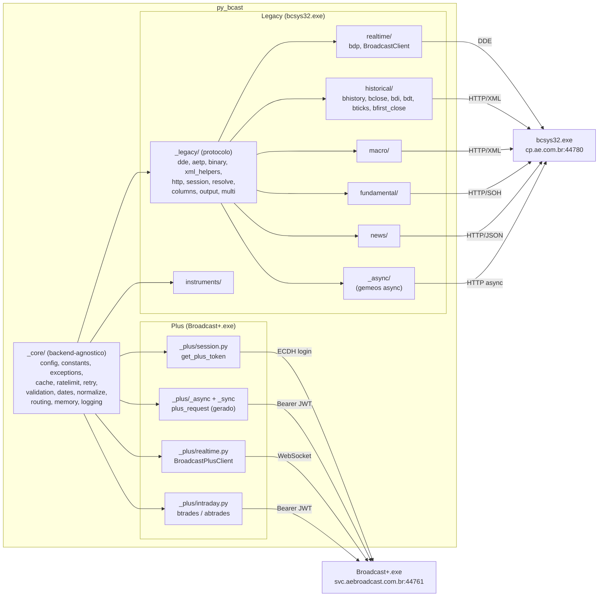

# Architecture

py_bcast suporta dois backends independentes que rodam em paralelo:

| | Terminal Antigo | Terminal Novo |
|---|---|---|
| **Processo** | `bcsys32.exe` (Java/Win32) | `Broadcast+.exe` v7.4.4 (Electron) |
| **API** | `http://cp.ae.com.br:44780` (ContentProxy) | `https://svc.aebroadcast.com.br:44761` |
| **Tempo real** | DDE (Windows DDEML) | WebSocket |
| **Formato** | XML + binary SOH | JSON |
| **Auth** | Tag `10039` BCAA session token | JWT Bearer (ECDH P-384 login) |
| **Internals** | [`legacy/internals.md`](./legacy/internals.md) | [`plus/internals.md`](./plus/internals.md) |
| **Endpoints** | [`legacy/endpoints.md`](./legacy/endpoints.md) | [`plus/endpoints.md`](./plus/endpoints.md) |
| **API publica** | [`legacy/api.md`](./legacy/api.md) | [`plus/api.md`](./plus/api.md) |

Zero sobreposicao de endpoints entre os dois servidores. O backend Legacy concentra o stack de protocolo (DDE, AETP, ContentProxy HTTP, parsing e construcao de DataFrame) em `src/py_bcast/_legacy/`, com os pacotes de dominio (`historical/`, `macro/`, `fundamental/`, ...) no topo de `src/py_bcast/`; o backend Plus vive em `src/py_bcast/_plus/`. Os dois compartilham apenas a infraestrutura backend-agnostica de `src/py_bcast/_core/` — o Plus nunca importa de `_legacy/`.

---

## Shared Core (`_core/`)

Infraestrutura backend-agnostica — usada pelos dois backends.
Nenhum modulo aqui conhece protocolo Legacy ou Plus:

| Modulo | Proposito |
|--------|-----------|
| `config.py` | `Settings` dataclass com todos os parametros tunaveis. `configure(**kwargs)` atualiza em runtime; `get_settings()` retorna o singleton. Inclui campos `terminal`, `plus_login`, `plus_password`. |
| `routing.py` | `get_active_terminal()` resolve qual backend (`"legacy"` ou `"plus"`) atender em cada chamada. Auto-detecta por env var ou processo rodando. Cache invalidado por `configure(terminal=...)`. |
| `memory.py` | Win32 helpers compartilhados: `find_process_pid(image_name)` via `tasklist` e `scan_process_memory(pid, pattern)` com `ReadProcessMemory`. Usado pelos dois backends para extrair tokens. |
| `exceptions.py` | Hierarquia de excecoes: `PyBcastError` -> `SessionError`, `ContentProxyError`, `ProtocolError`, `DDEError`, `BroadcastPlusError`, `BroadcastPlusAuthError`. |
| `logging.py` | `get_logger(name)` factory; NullHandler por padrao. |
| `cache.py` | Cache de dois backends. `"memory"` usa dict TTL thread-safe; `"disk"` usa `diskcache`. |
| `ratelimit.py` | Token-bucket rate limiter. `rate_limit()` (sync) e `rate_limit_async()` (async). |
| `retry.py` | `@http_retry` decorator via Tenacity. Retries em HTTP 5xx e erros de conexao. |
| `validation.py` | Tipos Pydantic (`Ticker`, `DateParam`, `CvmCode`, ...) e `@validate_params` decorator (async-aware). |
| `dates.py` | Fonte unica de coercao de datas: `to_date_str()` / `to_datetime_str()` (`validation.py` delega aqui). |
| `normalize.py` | Normalizacao de identificadores/valores compartilhada entre backends. |
| `constants.py` | Constantes de ambos os backends: `PLUS_BASE_URL`, `PLUS_WS_URL`, `PLUS_VERSION`, `PLUS_APP_ID`. Inclui `PLUS_EXCHANGE_NAME_TO_CODE` + `normalize_exchange()`. |

---

## Legacy protocol (`_legacy/`)

Stack de protocolo do Terminal Antigo (`bcsys32.exe`). Importado pelos pacotes de dominio Legacy
(`historical/`, `macro/`, `fundamental/`, `news/`, `realtime/`) e pelos gemeos `_async/`; nunca pelo
Plus. Depende de `_core/` para infraestrutura, nunca o contrario.

A camada de I/O e gerada: `_legacy/_async/` e a fonte escrita a mao (async-first) e
`_legacy/_sync/` e GERADA dela por `scripts/gen_sync.py` (unasync) — nunca editar a arvore
sync a mao. `tests/test_unasync.py` falha se a arvore gerada estiver desatualizada. Estado
compartilhado (singletons HTTP, caches de resolucao, rate limiter) vive fora das duas
arvores para que sync e async continuem compartilhando.

| Modulo | Proposito |
|--------|-----------|
| `dde.py` | Cliente DDEML (Windows DDEML) para tempo real (`bdp` / `BroadcastClient`). |
| `aetp.py` | Conhecimento puro do protocolo AETP: `rows_to_dicts()`, identificacao de entidade para NotFoundError. |
| `binary.py` | Parser de resposta binaria SOH: `parse_binary_response()`. |
| `xml_helpers.py` | Parsing XML ContentProxy puro: `parse_ticks()`, `raise_for_content_proxy_status()` (politica de erro de dois eixos). |
| `http.py` | Singletons `httpx.Client` / `httpx.AsyncClient` com connection pooling (estado compartilhado, fora do codegen). |
| `session.py` | Descoberta e cache do BCAA session token (tag `10039`) via memoria do `bcsys32.exe`. |
| `resolve_state.py` | Caches de resolucao compartilhados sync/async + matchers puros (`match_indicator`, `cvm_from_quote`). |
| `columns.py` | Schemas de coluna e renomeacao dos outputs Legacy (`CONTENT_PROXY_RENAME`, `VOLUME_RENAME`, ...). |
| `spec.py` | Descritores declarativos de endpoint: `EndpointSpec` / `ParamBind` (transporte, tags, politica de indice/erro, vetorizacao). |
| `endpoints.py` | Catalogo de `EndpointSpec` — um spec por endpoint migrado, compartilhado pelos executores sync e async. |
| `output.py` | Finalizacao de DataFrame: `finalize_frame()` (politica de indice via enum `Index`, strip de sufixo `.BVMF`), `empty_history_frame()`. |
| `multi.py` | Fan-out multi-ticker: `vectorize()` / `vectorize_async()` (residuo de concorrencia deliberado, fora do codegen). |
| `_async/` | FONTE da camada de I/O (async): `transport.py` (`aetp_request`, `content_proxy_get`), `executor.py` (`run_spec`), `resolve.py`, `quote.py`, `ohlcv.py` (bhistory OHLCV core), `ticks.py` (bticks core), `markit.py` (CDS). |
| `_sync/` | Camada de I/O sync GERADA — mesmos modulos/nomes da fonte, tokens async removidos. NAO EDITAR. |

---

## Referencia Rapida

| O que voce precisa | Onde esta |
|---|---|
| Como funciona o DDE / ContentProxy | [`legacy/internals.md`](./legacy/internals.md) |
| Catalogo de todos os endpoints Legacy | [`legacy/endpoints.md`](./legacy/endpoints.md) |
| API publica do Terminal Antigo | [`legacy/api.md`](./legacy/api.md) |
| Backlog de implementacao Legacy | [`legacy/roadmap.md`](./legacy/roadmap.md) |
| Limitacoes e blockers Legacy | [`legacy/limitations.md`](./legacy/limitations.md) |
| Como funciona o auth ECDH / WebSocket Plus | [`plus/internals.md`](./plus/internals.md) |
| Catalogo de todos os endpoints Plus | [`plus/endpoints.md`](./plus/endpoints.md) |
| API publica do Terminal Novo | [`plus/api.md`](./plus/api.md) |
| Backlog de implementacao Plus | [`plus/roadmap.md`](./plus/roadmap.md) |
| Limitacoes e blockers Plus | [`plus/limitations.md`](./plus/limitations.md) |
| Mapeamento cruzado Legacy vs Plus | [`compatibility.md`](./compatibility.md) |
| Banco de instrumentos aetp_17.dat | [`legacy/instruments.md`](./legacy/instruments.md) |
| Campos DDE (ULT, VAR, MAX, ...) | [`legacy/fields.md`](./legacy/fields.md) |
