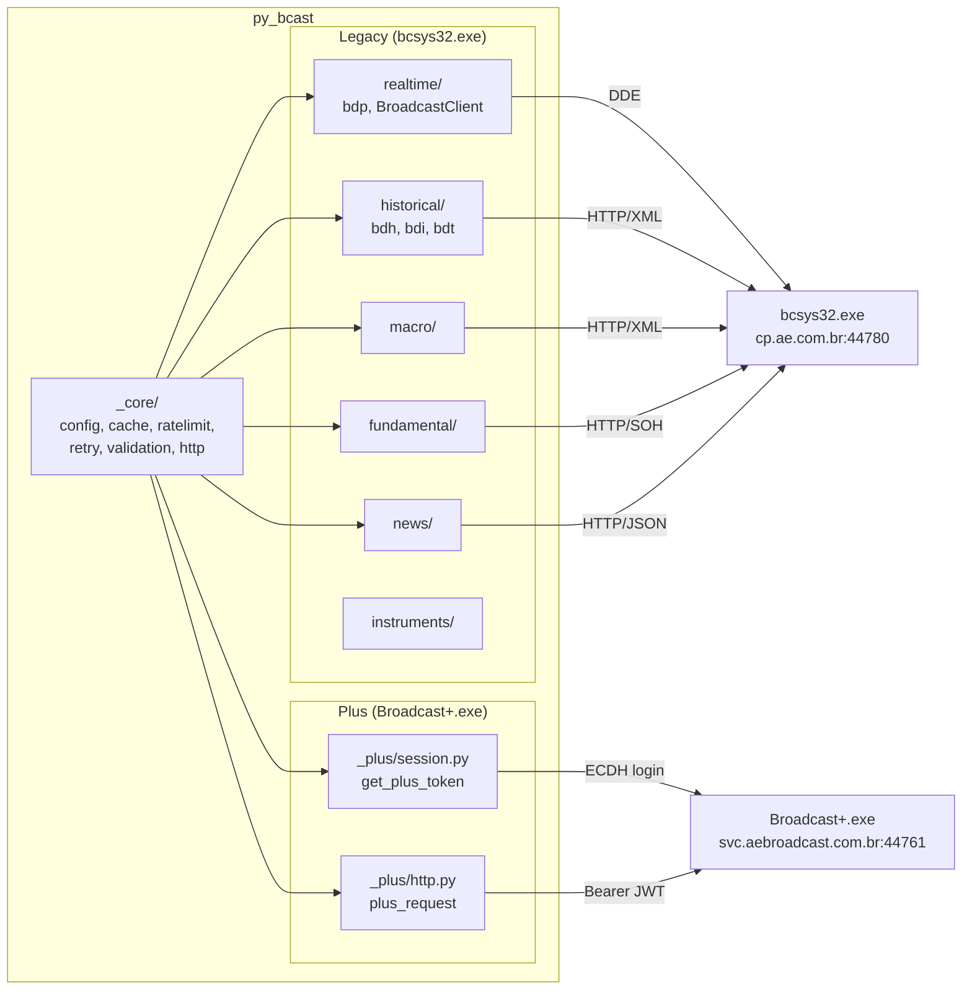

# Architecture

py_bcast suporta dois backends independentes que rodam em paralelo:

| | Terminal Antigo | Terminal Novo |
|---|---|---|
| **Processo** | `bcsys32.exe` (Java/Win32) | `Broadcast+.exe` v7.4.4 (Electron) |
| **API** | `http://cp.ae.com.br:44780` (ContentProxy) | `https://svc.aebroadcast.com.br:44761` |
| **Tempo real** | DDE (Windows DDEML) | WebSocket |
| **Formato** | XML + binary SOH | JSON |
| **Auth** | Tag `10039` BCAA session token | JWT Bearer (ECDH P-384 login) |
| **Internals** | [`legacy/internals.md`](./legacy/internals.md) | [`plus/internals.md`](./plus/internals.md) |
| **Endpoints** | [`legacy/endpoints.md`](./legacy/endpoints.md) | [`plus/endpoints.md`](./plus/endpoints.md) |
| **API publica** | [`legacy/api.md`](./legacy/api.md) | [`plus/api.md`](./plus/api.md) |

Zero sobreposicao de endpoints entre os dois servidores. Cada backend tem seu subpacote (`src/py_bcast/` para Legacy, `src/py_bcast/_plus/` para Plus) e compartilha o `_core/` com o outro.

---

## Shared Core (`_core/`)

Infraestrutura interna compartilhada pelos dois backends:

| Modulo | Proposito |
|--------|-----------|
| `config.py` | `Settings` dataclass com todos os parametros tunaveis. `configure(**kwargs)` atualiza em runtime; `get_settings()` retorna o singleton. Inclui campos `terminal`, `plus_login`, `plus_password`. |
| `routing.py` | `get_active_terminal()` resolve qual backend (`"legacy"` ou `"plus"`) atender em cada chamada. Auto-detecta por env var ou processo rodando. Cache invalidado por `configure(terminal=...)`. |
| `memory.py` | Win32 helpers compartilhados: `find_process_pid(image_name)` via `tasklist` e `scan_process_memory(pid, pattern)` com `ReadProcessMemory`. Usado pelos dois backends para extrair tokens. |
| `exceptions.py` | Hierarquia de excecoes: `PyBcastError` -> `SessionError`, `ContentProxyError`, `ProtocolError`, `DDEError`, `BroadcastPlusError`, `BroadcastPlusAuthError`. |
| `logging.py` | `get_logger(name)` factory; NullHandler por padrao. |
| `http.py` | Singleton `httpx.Client` e `httpx.AsyncClient` com connection pooling (Legacy ContentProxy). |
| `cache.py` | Cache de dois backends. `"memory"` usa dict TTL thread-safe; `"disk"` usa `diskcache`. |
| `ratelimit.py` | Token-bucket rate limiter. `rate_limit()` (sync) e `rate_limit_async()` (async). |
| `retry.py` | `@http_retry` decorator via Tenacity. Retries em HTTP 5xx e erros de conexao. |
| `validation.py` | Tipos Pydantic (`Ticker`, `DateParam`, `CvmCode`, ...) e `@validate_params` decorator. |
| `constants.py` | Constantes de ambos os backends: `PLUS_BASE_URL`, `PLUS_WS_URL`, `PLUS_VERSION`, `PLUS_APP_ID`. Inclui `PLUS_EXCHANGE_NAME_TO_CODE` + `normalize_exchange()`. |

---

## Referencia Rapida

| O que voce precisa | Onde esta |
|---|---|
| Como funciona o DDE / ContentProxy | [`legacy/internals.md`](./legacy/internals.md) |
| Catalogo de todos os endpoints Legacy | [`legacy/endpoints.md`](./legacy/endpoints.md) |
| API publica do Terminal Antigo | [`legacy/api.md`](./legacy/api.md) |
| Backlog de implementacao Legacy | [`legacy/roadmap.md`](./legacy/roadmap.md) |
| Limitacoes e blockers Legacy | [`legacy/limitations.md`](./legacy/limitations.md) |
| Como funciona o auth ECDH / WebSocket Plus | [`plus/internals.md`](./plus/internals.md) |
| Catalogo de todos os endpoints Plus | [`plus/endpoints.md`](./plus/endpoints.md) |
| API publica do Terminal Novo | [`plus/api.md`](./plus/api.md) |
| Backlog de implementacao Plus | [`plus/roadmap.md`](./plus/roadmap.md) |
| Limitacoes e blockers Plus | [`plus/limitations.md`](./plus/limitations.md) |
| Mapeamento cruzado Legacy vs Plus | [`compatibility.md`](./compatibility.md) |
| Banco de instrumentos aetp_17.dat | [`legacy/instruments.md`](./legacy/instruments.md) |
| Campos DDE (ULT, VAR, MAX, ...) | [`legacy/fields.md`](./legacy/fields.md) |
