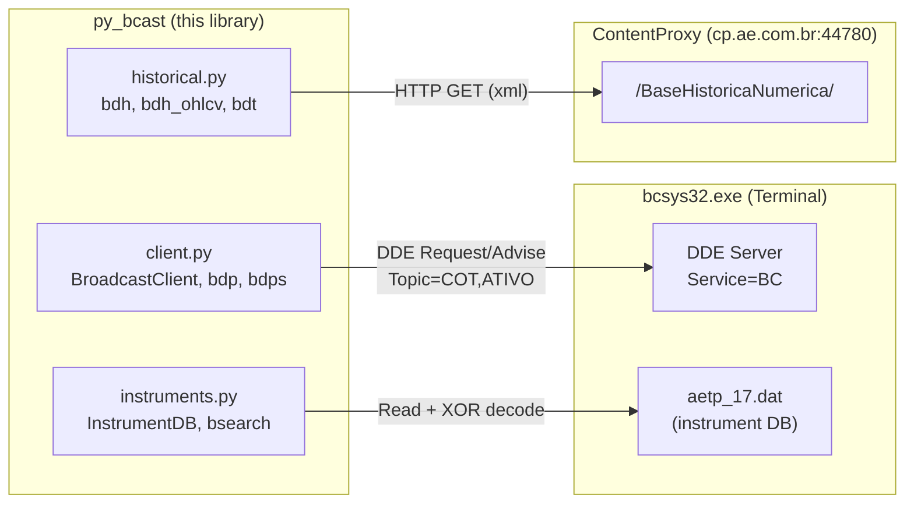
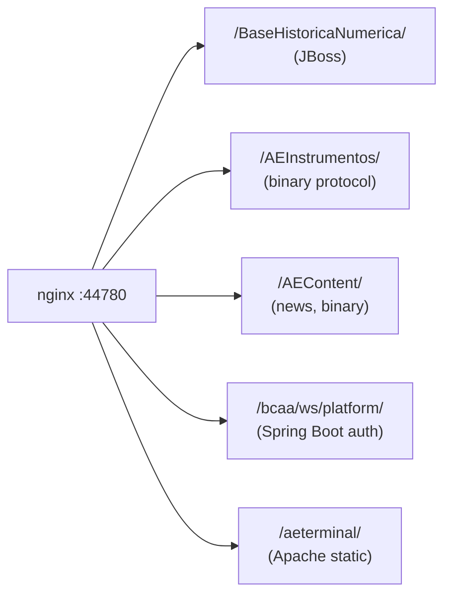

# Architecture

## System Overview

py_bcast interfaces with AE Broadcast through **two data channels**:

## Data Channels

| # | Channel | Module | Protocol | Data |
|---|---------|--------|----------|------|
| 1 | DDE | `client.py` | Win32 DDEML | Real-time quotes, streaming, snapshots |
| 2 | HTTP | `historical.py` | REST/XML | Daily history, OHLCV, tick data |
| 3 | Local file | `instruments.py` | XOR(0xAE) TSV | 623K instruments, 30+ exchanges |

## DDE Protocol

The Broadcast terminal exposes market data via Windows DDE — the same mechanism used by its Excel add-in.

### Addressing

| Component | Value | Notes |
|-----------|-------|-------|
| Service | `BC` | Fixed |
| Topic | `COT` | Real-time quotes |
| Topic | `ATIVO` | Full snapshot (56 fields) |
| Item | `TICKER.FIELD` | Dot separator |

### Operating Modes

| Mode | DDE Operation | py_bcast Function |
|------|--------------|-------------------|
| Request | `XTYP_REQUEST` | `bdp()`, `BroadcastClient.request()` |
| Advise | `XTYP_ADVSTART` | `BroadcastClient.subscribe()` |
| Snapshot | Request on ATIVO | `BroadcastClient.snapshot()` |

### Implementation Notes

- **pywin32 `dde` module** — for one-shot Request (simple, high-level)
- **ctypes DDEML** — for Advise/streaming (message pump + 64-bit callback)
- On Windows x64, DDE handles (HDDEDATA, HCONV, HSZ) are 8-byte pointers → use `ctypes.c_ssize_t`, not `c_ulong`

## HTTP ContentProxy

### Infrastructure

### Authentication

| Mechanism | Usage |
|-----------|-------|
| Tag `10039` in query string | Primary — bypasses nginx auth |
| Basic Auth `broad:@&Br0@dc@st` | Fallback for static resources |
| BCAA session token | Hex string obtained from terminal config |

### Working Endpoints

| Endpoint | Purpose | Function |
|----------|---------|----------|
| `HistoricoFechamentos` | Multi-symbol daily closing | `bdh()` |
| `HistoricoData` | Single-symbol OHLCV | `bdh_ohlcv()` |
| `HistoricoTick` | Tick-by-tick trades | `bdt()` |

### Query Parameters (Tags)

| Tag | Name | Format |
|-----|------|--------|
| 10023 | Platform | `4` (fixed) |
| 10039 | Session | BCAA session token |
| 305 | Symbol | Ticker (e.g., `PETR4`) |
| 10077 | Date | `YYYYMMDD` |
| 10113 | Symbols | Semicolon-separated |
| 10071 | Start datetime | `YYYYMMDDHHMMSS` |
| 10072 | End datetime | `YYYYMMDDHHMMSS` |
| TipoResposta | Response format | `xml` |
| Precisao | Decimal places | `0`–`5` |
| DatasTolerancia | Date list | Semicolon-separated `YYYYMMDD` |

## Instrument Database

The terminal maintains a local instrument master file:

| Property | Value |
|----------|-------|
| Path | `%APPDATA%\Agencia Estado\Broadcast\DataFiles\aetp_17.dat` |
| Size | ~105 MB |
| Encoding | XOR with key `0xAE` |
| Format | TSV (tab-separated) |
| Header | Tag numbers as column names |
| Records | 623,247 instruments |
| Exchanges | 30+ (BVMF, GTISFX, CMX, ICEEU, etc.) |

### Key Columns

| Tag | Content | Example |
|-----|---------|---------|
| 305 | Full symbol | `PETR4.BVMF` |
| 10068 | Short ticker | `PETR4` |
| 10045 | Name | `PETROLEO BRASILEIRO S.A. PETROBRAS, PN` |
| 303 | ISIN | `BRPETRACNPR6` |
| 10092 | Exchange ID | `BVMF` |

## Data Format Conventions

- Numbers use **comma** as decimal separator (pt-BR locale): `44,60`
- DDE dates: `dd/mm/yyyy` (e.g., `19/05/2026`)
- DDE times: `HH:MM` (e.g., `15:19`)
- HTTP dates: `YYYYMMDD`
- Tick times: `HH:MM:SS.mmm`
- Variation as signed percentage: `-3,2328`
