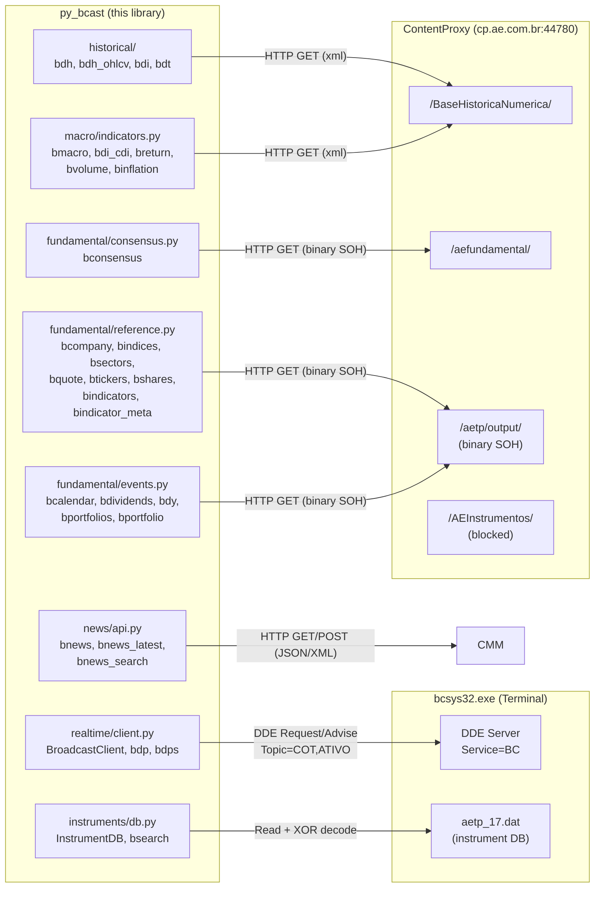
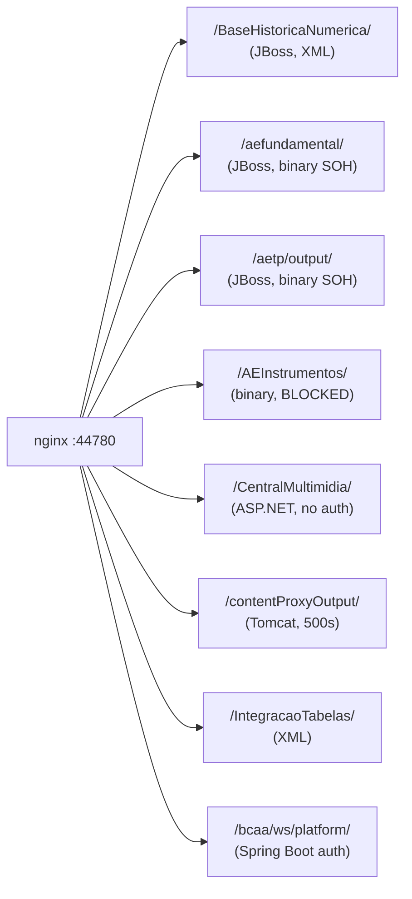

# Architecture

## System Overview

py_bcast interfaces with AE Broadcast through **five data channels**:

## Data Channels

| # | Channel | Module | Protocol | Data |
|---|---------|--------|----------|------|
| 1 | DDE | `realtime/client.py` | Win32 DDEML | Real-time quotes, streaming, snapshots |
| 2 | HTTP | `historical/` | REST/XML | Daily history, intraday OHLCV, tick data |
| 3 | HTTP | `macro/indicators.py` | REST/XML | Macro series, CDI, returns, volumes, inflation |
| 4 | HTTP | `fundamental/consensus.py` | REST/binary SOH | Analyst consensus |
| 5 | HTTP | `fundamental/reference.py` | REST/binary SOH | Companies, indices, sectors, quotes, indicators |
| 6 | HTTP | `fundamental/events.py` | REST/binary SOH | Calendar, dividends, DY, broker portfolios |
| 7 | HTTP | `news/api.py` | REST/JSON+XML | News, podcasts, multimedia (no auth) |
| 8 | Local file | `instruments/db.py` | XOR(0xAE) TSV | 623K instruments, 30+ exchanges |

### Endpoint Groups (HTTP)

| Group | Path | Protocol | Status | Count |
|-------|------|----------|--------|-------|
| BaseHistoricaNumerica | `/BaseHistoricaNumerica/` | XML | ~18 working | ~30 total |
| aefundamental | `/aefundamental/` | Binary SOH | 7 working | ~15 total |
| aetp/output | `/aetp/output/` | Binary SOH | **~40 working** | ~60 total |
| CentralMultimidia | `/CentralMultimidia/` | JSON/XML | **2 working** | 2 total |
| AEInstrumentos | `/AEInstrumentos/` | Binary (proprietary) | ALL blocked | ~50 total |
| AEContent | `/AEContent/` | Binary (proprietary) | ALL blocked | ~8 total |
| contentProxyOutput | `/contentProxyOutput/` | JSON/XML | ALL 500 errors | ~30 total |
| IntegracaoTabelas | `/IntegracaoTabelas/` | XML | 4 working | ~6 total |
| MarkitOutput2 | `/MarkitOutput2/` | XML | 1 working | 5 total |

## DDE Protocol

The Broadcast terminal exposes market data via Windows DDE — the same mechanism used by its Excel add-in.

### Addressing

| Component | Value | Notes |
|-----------|-------|-------|
| Service | `BC` | Fixed |
| Topic | `COT` | Real-time quotes |
| Topic | `ATIVO` | Full snapshot (56 fields) |
| Item | `TICKER.FIELD` | Dot separator |

### Operating Modes

| Mode | DDE Operation | py_bcast Function |
|------|--------------|-------------------|
| Request | `XTYP_REQUEST` | `bdp()`, `BroadcastClient.request()` |
| Advise | `XTYP_ADVSTART` | `BroadcastClient.subscribe()` |
| Snapshot | Request on ATIVO | `BroadcastClient.snapshot()` |

### Implementation Notes

- **pywin32 `dde` module** — for one-shot Request (simple, high-level)
- **ctypes DDEML** — for Advise/streaming (message pump + 64-bit callback)
- On Windows x64, DDE handles (HDDEDATA, HCONV, HSZ) are 8-byte pointers → use `ctypes.c_ssize_t`, not `c_ulong`

## HTTP ContentProxy

### Infrastructure

### Authentication

| Mechanism | Usage |
|-----------|-------|
| Tag `10039` in query string | Primary — bypasses nginx auth |
| Basic Auth `broad:@&Br0@dc@st` | Fallback for static resources |
| BCAA session token | Hex string obtained from terminal config |
| None (public) | `/CentralMultimidia/` — news & multimedia |

### Working Endpoints (Implemented in py-bcast)

| Endpoint | Path | Function |
|----------|------|----------|
| `HistoricoFechamentos` | BaseHistoricaNumerica | `bdh()` |
| `HistoricoData` | BaseHistoricaNumerica | `bdh_ohlcv()` |
| `HistoricoIntraday` | BaseHistoricaNumerica | `bdi()` |
| `HistoricoTick` | BaseHistoricaNumerica | `bdt()` |
| `MacroEconomicos` | BaseHistoricaNumerica | `bmacro()` |
| `DiCetipAcumulado` | BaseHistoricaNumerica | `bdi_cdi()` |
| `RetornoDiario` | BaseHistoricaNumerica | `breturn()` |
| `VolumesMedios` | BaseHistoricaNumerica | `bvolume()` |
| `Inflacao` | BaseHistoricaNumerica | `binflation()` |
| `aefundamental/consenso` | aefundamental | `bconsensus()` |
| `fundamental/empresa/metadado` | aetp/output | `bcompany()` |
| `fundamental/empresa` | aetp/output | `bcompany(cvm_code)` |
| `ativos/indice` | aetp/output | `bindices()` |
| `fundamental/setor` | aetp/output | `bsectors()` |
| `fundamental/ativo/cotacao` | aetp/output | `bquote()` |
| `fundamental/ativo/simbolo` | aetp/output | `btickers()` |
| `fundamental/ativo/quantidade` | aetp/output | `bshares()` |
| `fundamental/indicador/metadado` | aetp/output | `bindicator_meta()` |
| `fundamental/indicador/historico-diario` | aetp/output | `bindicators()` |
| `fundamental/calendario-eventos-corporativos` | aetp/output | `bcalendar()` |
| `fundamental/empresa/eventos/jcp-dividendos` | aetp/output | `bdividends()` |
| `fundamental/empresa/eventos/dividend-yield` | aetp/output | `bdy()` |
| `fundamental/empresa/carteira-recomendada/corretoras` | aetp/output | `bportfolios()` |
| `fundamental/empresa/carteira-recomendada/ultima` | aetp/output | `bportfolio()` |

### Working Endpoints (Not Yet Implemented)

See `docs/compatibility.md` for the full list. Key remaining opportunities:

| Endpoint | Path | Data |
|----------|------|------|
| EmpresasHistorico | BaseHistoricaNumerica | Full quarterly financials (1.2MB!) |
| FIIAnbimaBovespa | BaseHistoricaNumerica | FII: div yield, last dividend, avg volume |
| HistoricoDiarioSimbolos | BaseHistoricaNumerica | Multi-ticker daily (alternative to bdh) |
| Volatilidades | BaseHistoricaNumerica | Historical volatility |
| Fundos | BaseHistoricaNumerica | Fund NAV/quote history |
| TitulosPublicos | BaseHistoricaNumerica | Government bonds |
| CalculoTaxaPre | BaseHistoricaNumerica | Pre-fixed rate curve |
| CarteiraTopFundos | aetp/output | Which funds invest in a stock |
| EmpresaAcoesUnits | aetp/output | Shares ON/PN, free float |

### Query Parameters (Tags)

| Tag | Name | Format |
|-----|------|--------|
| 10023 | Platform | `4` (fixed) |
| 10039 | Session | BCAA session token |
| 305 | Symbol | Ticker (e.g., `PETR4`) |
| 961 | Start date (series) | `YYYYMMDD` |
| 1789 | End date (series) | `YYYYMMDD` |
| 10029 | Precisao | Integer (decimal places) |
| 10057 | Start date (range) | `YYYYMMDD` |
| 10058 | End date (range) | `YYYYMMDD` |
| 10068 | Ticker (fundamental) | Ticker string |
| 10071 | Start datetime | `YYYYMMDDHHMMSS` |
| 10072 | End datetime | `YYYYMMDDHHMMSS` |
| 10074 | DataHoraInicioMinutos | `YYYYMMDDHHMM` (12 digits) |
| 10077 | Single date | `YYYYMMDD` |
| 10087 | Corretora (broker) ID | Integer |
| 10113 | Symbols (multi) | Semicolon-separated |
| 12078 | Number of days | Integer |
| 13004 | CVM company code | Integer (9512=Petrobras, 4170=Vale) |
| 13539 | Notional/value | Float |
| 13798 | Sector ID | Integer |
| TipoResposta | Response format | `xml` |
| DatasTolerancia | Date list | Semicolon-separated `YYYYMMDD` |

## Instrument Database

The terminal maintains a local instrument master file:

| Property | Value |
|----------|-------|
| Path | `%APPDATA%\Agencia Estado\Broadcast\DataFiles\aetp_17.dat` |
| Size | ~105 MB |
| Encoding | XOR with key `0xAE` |
| Format | TSV (tab-separated) |
| Header | Tag numbers as column names |
| Records | 623,247 instruments |
| Exchanges | 30+ (BVMF, GTISFX, CMX, ICEEU, etc.) |

### Key Columns

| Tag | Content | Example |
|-----|---------|---------|
| 305 | Full symbol | `PETR4.BVMF` |
| 10068 | Short ticker | `PETR4` |
| 10045 | Name | `PETROLEO BRASILEIRO S.A. PETROBRAS, PN` |
| 303 | ISIN | `BRPETRACNPR6` |
| 10092 | Exchange ID | `BVMF` |

## Data Format Conventions

- Numbers use **comma** as decimal separator (pt-BR locale): `44,60`
- DDE dates: `dd/mm/yyyy` (e.g., `19/05/2026`)
- DDE times: `HH:MM` (e.g., `15:19`)
- HTTP dates: `YYYYMMDD`
- Tick times: `HH:MM:SS.mmm`
- Variation as signed percentage: `-3,2328`
