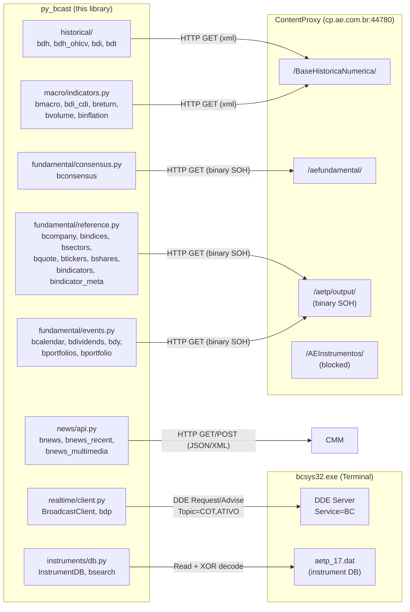
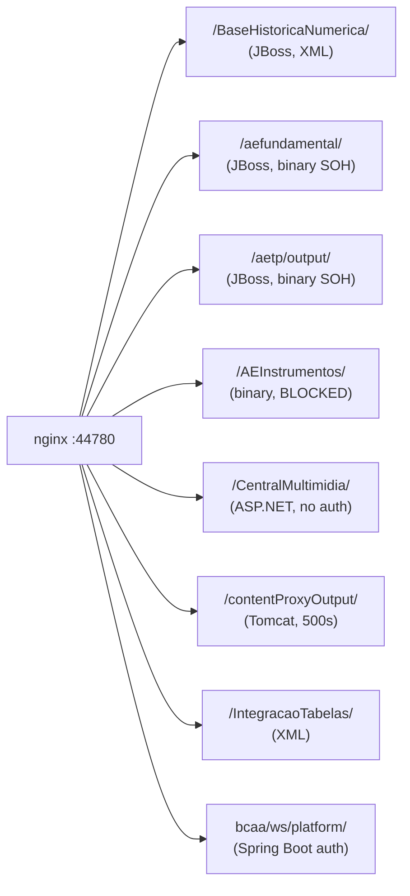

# Terminal Antigo — Internals

Documentacao tecnica interna do backend `bcsys32.exe` + ContentProxy (`cp.ae.com.br:44780`).

Cobre: protocolo DDE, infraestrutura HTTP do ContentProxy, grupos de endpoints, parametros de query, formatos de dados, banco de instrumentos e historico de exploracao do protocolo.

---

## Visao Geral

| Atributo | Valor |
|---|---|
| Processo | `bcsys32.exe` (Java/Win32 nativo) |
| Dados em tempo real | DDE (Windows DDEML) |
| API HTTP | `http://cp.ae.com.br:44780` (nginx reverse proxy) |
| Autenticacao HTTP | Tag `10039` no query string (BCAA session token, 33 chars hex) |
| Respostas HTTP | XML + binary SOH |
| Banco de instrumentos | `%APPDATA%\Agencia Estado\Broadcast\DataFiles\aetp_17.dat` |

O terminal expoe **cinco canais de dados** consumidos pela lib:



### Canais de Dados

| # | Canal | Modulo | Protocolo | Dados |
|---|-------|--------|-----------|-------|
| 1 | DDE | `realtime/client.py` | Win32 DDEML | Cotacoes em tempo real, streaming, snapshots |
| 2 | HTTP | `historical/` | REST/XML | Historico diario, intraday OHLCV, tick data |
| 3 | HTTP | `macro/indicators.py` | REST/XML | Series macro, CDI, retornos, volumes, inflacao |
| 4 | HTTP | `fundamental/consensus.py` | REST/binary SOH | Consenso de analistas |
| 5 | HTTP | `fundamental/reference.py` | REST/binary SOH | Empresas, indices, setores, cotacoes, indicadores |
| 6 | HTTP | `fundamental/events.py` | REST/binary SOH | Calendario, dividendos, DY, carteiras de corretoras |
| 7 | HTTP | `news/api.py` | REST/JSON+XML | Noticias, podcasts, multimidia (sem auth) |
| 8 | Arquivo local | `instruments/db.py` | XOR(0xAE) TSV | 623K instrumentos, 30+ exchanges |

---

## Protocolo DDE

O terminal expoe dados de mercado via Windows DDE — o mesmo mecanismo usado pelo add-in Excel.

### Enderecamento

| Componente | Valor | Notas |
|-----------|-------|-------|
| Service | `BC` | Fixo |
| Topic | `COT` | Cotacoes em tempo real |
| Topic | `ATIVO` | Snapshot completo (56 campos) |
| Item | `TICKER.FIELD` | Separador ponto |

### Modos de Operacao

| Modo | Operacao DDE | Funcao py_bcast |
|------|-------------|-----------------|
| Request | `XTYP_REQUEST` | `bdp()`, `BroadcastClient.request()` |
| Advise | `XTYP_ADVSTART` | `BroadcastClient.subscribe()` |
| Snapshot | Request no ATIVO | `BroadcastClient.snapshot()` |

### Notas de Implementacao

- **pywin32 `dde` module** — para Request pontual (simples, alto nivel)
- **ctypes DDEML** — para Advise/streaming (message pump + callback 64-bit)
- Em Windows x64, handles DDE (HDDEDATA, HCONV, HSZ) sao ponteiros de 8 bytes — usar `ctypes.c_ssize_t`, nao `c_ulong`
- Topic `COT`: cotacoes em tempo real com todos os campos (ULT, VAR, MAX, MIN, etc.)
- Topic `ATIVO`: snapshot de todos os 56 campos cadastrais de uma vez

---

## ContentProxy HTTP

### Infraestrutura



### Autenticacao

| Mecanismo | Uso |
|-----------|-----|
| Tag `10039` no query string | Primario — bypassa auth do nginx |
| Basic Auth `broad:senha` | Fallback para recursos estaticos |
| BCAA session token | String hex obtida da config do terminal |
| Nenhum (publico) | `/CentralMultimidia/` — noticias e multimidia |

O token BCAA e descoberto via scan de memoria do `bcsys32.exe` (tag 10039 na URL de configuracao interna). Auto-renovado por scan a cada restart.

### Grupos de Endpoints

| Grupo | Path | Protocolo | Status | Total |
|-------|------|-----------|--------|-------|
| BaseHistoricaNumerica | `/BaseHistoricaNumerica/` | XML | ~18 funcionais | ~30 total |
| aefundamental | `/aefundamental/` | Binary SOH | 7 funcionais | ~15 total |
| aetp/output | `/aetp/output/` | Binary SOH | **~40 funcionais** | ~60 total |
| CentralMultimidia | `/CentralMultimidia/` | JSON/XML | **2 funcionais** | 2 total |
| AEInstrumentos | `/AEInstrumentos/` | Binary (proprietary) | TODOS bloqueados | ~50 total |
| AEContent | `/AEContent/` | Binary (proprietary) | TODOS bloqueados | ~8 total |
| contentProxyOutput | `/contentProxyOutput/` | JSON/XML | Maioria erro 500; 116/120 vivos | ~30 total |
| IntegracaoTabelas | `/IntegracaoTabelas/` | XML | 4 funcionais | ~6 total |
| MarkitOutput2 | `/MarkitOutput2/` | XML | 5 funcionais | 5 total |

---

## Parametros de Query (Tags)

Todos os endpoints HTTP usam query string com tags numericas:

| Tag | Nome | Formato |
|-----|------|---------|
| 10023 | Platform | `4` (fixo) |
| 10039 | Session | BCAA session token |
| 305 | Symbol | Ticker (ex: `PETR4`) |
| 961 | Data inicio (serie) | `YYYYMMDD` |
| 1789 | Data fim (serie) | `YYYYMMDD` |
| 10029 | Precisao | Inteiro (casas decimais) |
| 10057 | Data inicio (range) | `YYYYMMDD` |
| 10058 | Data fim (range) | `YYYYMMDD` |
| 10068 | Ticker (fundamental) | String |
| 10071 | Datetime inicio | `YYYYMMDDHHMMSS` |
| 10072 | Datetime fim | `YYYYMMDDHHMMSS` |
| 10074 | DataHoraInicioMinutos | `YYYYMMDDHHMM` (12 digits) |
| 10077 | Data unica | `YYYYMMDD` |
| 10087 | Corretora (broker) ID | Inteiro |
| 10113 | Symbols (multi) | Separados por ponto-e-virgula |
| 12078 | Numero de dias | Inteiro |
| 13004 | Codigo CVM da empresa | Inteiro (9512=Petrobras, 4170=Vale) |
| 13539 | Notional/valor | Float |
| 13798 | ID do setor | Inteiro |
| TipoResposta | Formato de resposta | `xml` |
| DatasTolerancia | Lista de datas | Separadas por `;` no formato `YYYYMMDD` |

---

## Formatos de Dados

### Datas e Horarios

| Contexto | Formato | Exemplo |
|----------|---------|---------|
| DDE dates | `dd/mm/yyyy` | `19/05/2026` |
| DDE times | `HH:MM` | `15:19` |
| HTTP dates (query) | `YYYYMMDD` | `20260519` |
| HTTP datetime (intraday) | `YYYYMMDDHHMMSS` | `20260519100000` |
| Tick times (response) | `HH:MM:SS.mmm` | `10:00:00.123` |

### Numeros

- Separador decimal: **virgula** (locale pt-BR): `44,60`
- Variacao como porcentagem com sinal: `-3,2328`

---

## Protocolo Binary SOH (aetp/output e aefundamental)

Formato de resposta de todos os endpoints `aefundamental/` e `aetp/output/`:

```
Record[0]: [version, ?, ?, ?]           -- header
Record[1]: [metadata_count, k1, v1..]  -- "0" = sem metadata, N = N pares chave-valor
Record[2]: [field_count, tag1, tag2..]  -- definicoes de campos
Record[3+]: [val1, val2, ...]           -- linhas de dados (\x02 = repetir valor anterior)
Last:       [\x03]                      -- terminador ETX
```

- Records separados por SOH (0x01)
- Fields dentro de um record separados por NULL (0x00)
- STX (0x02) = "mesmo valor da linha anterior" (compressao)
- ETX (0x03) = fim do stream
- Erros detectados pela presenca do tag `10037` nos dados brutos

O decoder em `src/py_bcast/_legacy/binary.py` (`parse_binary_response()`) ja suporta todos esses casos. **Nao ha trabalho adicional de protocolo para implementar novos endpoints desses grupos** — apenas mapear os campos de resposta.

---

## Banco de Instrumentos (aetp_17.dat)

O terminal mantem um arquivo mestre local de instrumentos:

| Propriedade | Valor |
|-------------|-------|
| Path | `%APPDATA%\Agencia Estado\Broadcast\DataFiles\aetp_17.dat` |
| Tamanho | ~105 MB |
| Encoding | XOR com chave `0xAE` |
| Formato | TSV (tab-separated) |
| Header | Numeros de tag como nomes de coluna |
| Registros | 623.247 instrumentos |
| Exchanges | 30+ (BVMF, GTISFX, CMX, ICEEU, etc.) |

### Colunas Principais

| Tag | Conteudo | Exemplo |
|-----|----------|---------|
| 305 | Simbolo completo | `PETR4.BVMF` |
| 10068 | Ticker curto | `PETR4` |
| 10045 | Nome | `PETROLEO BRASILEIRO S.A. PETROBRAS, PN` |
| 303 | ISIN | `BRPETRACNPR6` |
| 10092 | Exchange ID | `BVMF` |

Ver [`instruments.md`](./instruments.md) para a lista completa de exchanges e convencoes de simbolos.

---

## Historico de Exploracao do Protocolo

Cronologia das abordagens tentadas antes de descobrir que DDE e o caminho correto para dados em tempo real:

1. **COM Registry scan** — Encontrou Bloomberg.Rtd e Bofaddin.RtdServer (ambos Bloomberg, nao Broadcast)
2. **DDE probe inicial** — Testou apps/topicos errados (Broadcast/PETR4, BRTDDE, etc.)
3. **Analise de instalacao** — Mapeou DLLs .NET (AESpcNET), XLL, configs
4. **AETP TCP client** — Conectou porta 8100, decodificou header, nunca recebeu dados
5. **RTD COM** — Segfault ao implementar IRTDUpdateEvent; Bofaddin = Bloomberg
6. **SPC .NET** (7 iteracoes) — Conecta, aceita subscriptions, nunca entrega dados
7. **MITM SPC** — Proxy TCP entre client e server para capturar protocolo
8. **Protocol test** — Testou 7 formatos de mensagem TCP; server crashou
9. **XLL extraction** — Extraiu PEs embeddados, analisou ASM, encontrou DDE strings
10. **DDE com campos corretos** — **SUCESSO** com Service=BC, Topic=COT, Item=TICKER.FIELD

### AETP (TCP:8100) — Header

```
Offset  Size  Descricao
0x00    4     Magic: 1a fe ce fa
0x04    4     Payload length (uint32 LE)
0x08    1     Checksum (XOR de todos os bytes do payload)
0x09    N     Payload
```

O servidor AETP aceita conexoes e responde, mas nao entrega dados reais a clientes externos — apenas ao terminal desktop que tem sessoes pre-registradas. Endpoints que dependem de pre-registro retornam `Query=NONE`.

### SPC .NET (AESpcNET.dll)

Conecta com sucesso, aceita subscriptions de tickers, mas nunca entrega updates. O servidor so envia dados para o processo Java do terminal (verificado via MITM proxy TCP). Dead end.
